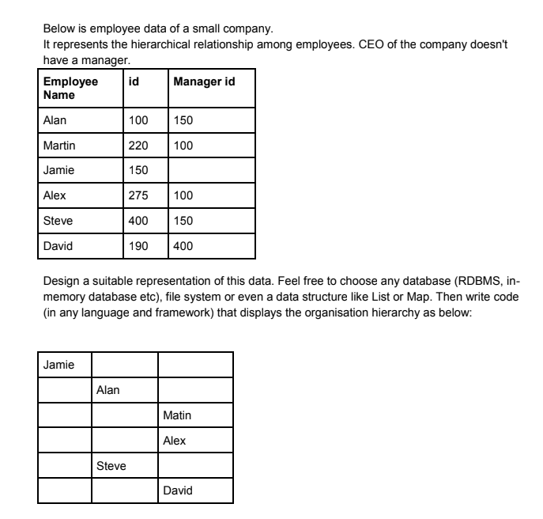

## Problem Statment



## Solution

We will implement the solution using plain javascript html and css.

We will use a in memory representation of employee data
```
data = [
    {name:"name",id:"id',managerId: "managerId"},...
]
```
The logic to convert this flat structure is to use a simple map to tag each list item with id and do a travel of the list appending respective mangerId element with its respective child list items

Code implementiaton is on `Index.html`
```
function list_to_tree 
```
